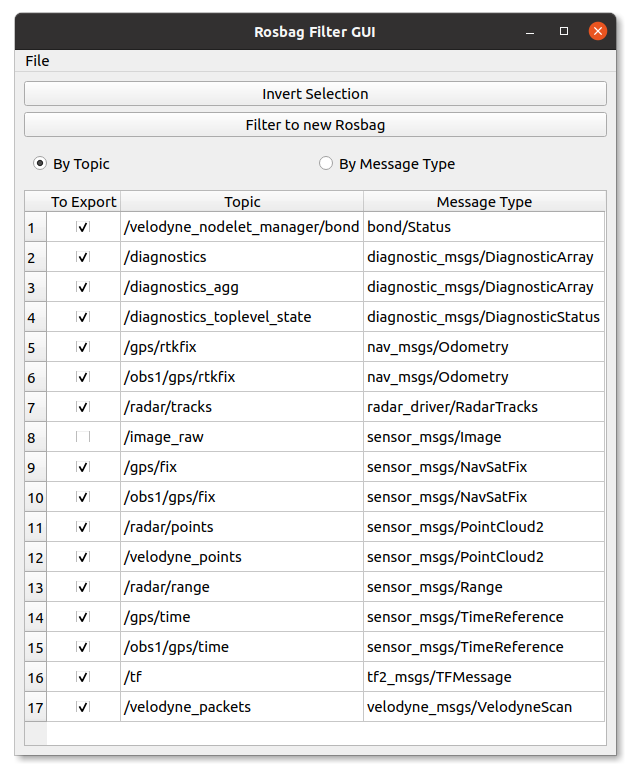

# Rosbag Filter UI
A simple PyQt5 wrapper around the `rosbag` command line utility.



# Features:
- Can select 1 to many rosbag files, and filter their topics all at once.
    - All selected rosbag files will have their topics all combined into one table, allowing you to filter similar rosbag files that may have varying topics
- Can select topics to filter by either directly by topic, or by message type
- Can invert your selection
- Filtered rosbag files are all saved in a selected directory, appended by `_filtered_timestamp`

# Issues:
- UI Freezes while exporting due to not exporting on separate thread
    - To be fixed eventually, but the functionaly works which is what is important

# Installation:

```bash
cd ~
git clone https://github.com/gstrenge/rosbag-filter-ui.git
cd ~/rosbag-filter-ui

mkdir rosbag-filter-ui-venv

python3 -m venv rosbag-filter-ui-venv
```

If you have ROS installed, run the following command:

```bash
./rosbag-filter-ui-venv/bin/pip3 install -r ros_requirements.txt 
```

If you **do not** have ros installed, and do not want to install it, run the following command:
```bash
./rosbag-filter-ui-venv/bin/pip3 install -r noros_requirements.txt --extra-index-url https://rospypi.github.io/simple/ 
```


# Usage:
If you have ROS installed, be sure to source ros before running to have access to necesary ROS python libraries:
```
source /opt/ros/<ROSDISTRO>/setup.bash
```

Run the following command:
```
source ./rosbag-filter-ui-venv/bin/activate
python3 main.py
```
